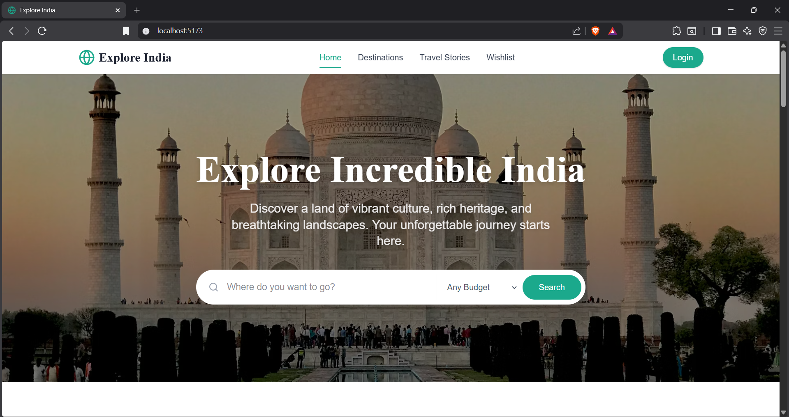
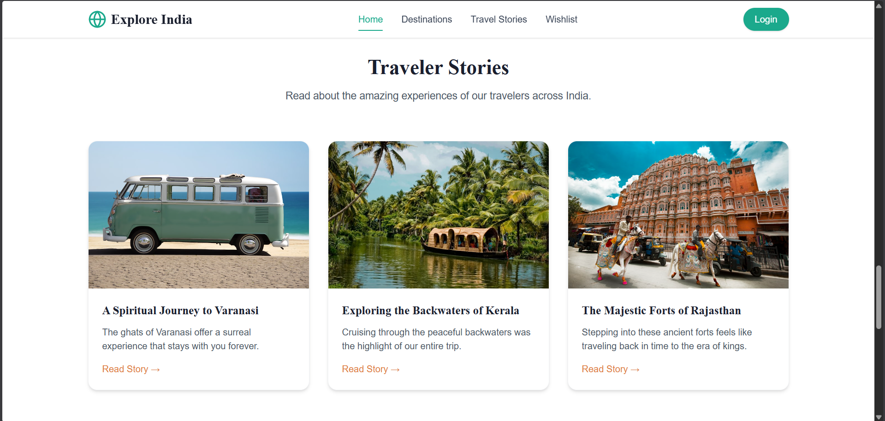
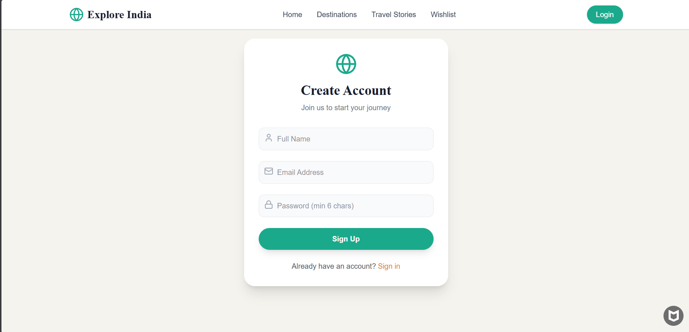

# 🌍 Explore India – Travel Website

A modern and interactive travel website designed to help users discover incredible destinations across India 🇮🇳.  
From spiritual places to beaches, hill stations, and wildlife – everything in one place.

---

## ✨ Preview






---

## 🚀 Features

- 🔍 **Search Destinations** with filters (budget, category)
- 🗺️ **Explore Categories**
  - Spiritual
  - Hill Stations
  - Beaches
  - Wildlife
  - Cultural
- ❤️ **Wishlist System** (Save favorite places)
- 📝 **Travel Stories Section**
- 🔐 **Authentication UI** (Login / Signup)
- 📱 **Fully Responsive Design**
- 🎨 **Modern UI/UX with clean components**
- ⚡ Smooth navigation and user-friendly experience

---

## 🧠 Project Idea

This project is built to provide a **complete travel exploration platform** where users can:

- Discover new places across India  
- Read travel experiences  
- Plan trips easily  
- Save favorite destinations  

---

## 🛠️ Tech Stack

### Frontend
- ⚛️ React.js
- 🎨 Tailwind CSS / CSS
- 🧩 Component-based architecture

### Backend (Future Scope)
- Node.js + Express
- MongoDB

---

## 📂 Project Structure
Explore-India/
│
├── src/
│ ├── components/
│ ├── pages/
│ ├── assets/
│ ├── hooks/
│ └── utils/
│
├── public/
├── screenshots/
├── package.json
└── README.md


---

## ⚙️ Installation & Setup

```bash
# Clone the repository
git clone https://github.com/tusharkewat/Explore-India.git

# Navigate to project folder
cd Explore-India

# Install dependencies
npm install

# Start development server
npm run dev

---

## 📸 Key Sections
🏠 Home Page
 - Hero section with search bar
 - Featured destinations
 - Category cards
🌍 Destinations
 - Filter by category & budget
 - Beautiful destination cards
📖 Travel Stories
 - Blog-style travel experiences
❤️ Wishlist
 - Save and manage favorite places
🔐 Authentication
 - Signup & Login UI

##🔮 Future Improvements
- 🔐 Full authentication system (JWT / OAuth)
- 📍 Google Maps integration
- 💳 Booking system
- 🤖 AI-based travel recommendations
- 📊 Admin dashboard
- 🌐 Multi-language support

## ⭐ Support

If you like this project:

👉 Give it a ⭐ on GitHub
👉 Share with friends

## 📌 License

This project is licensed under the MIT License

##💡 "Travel is the only thing you buy that makes you richer." ✈️
